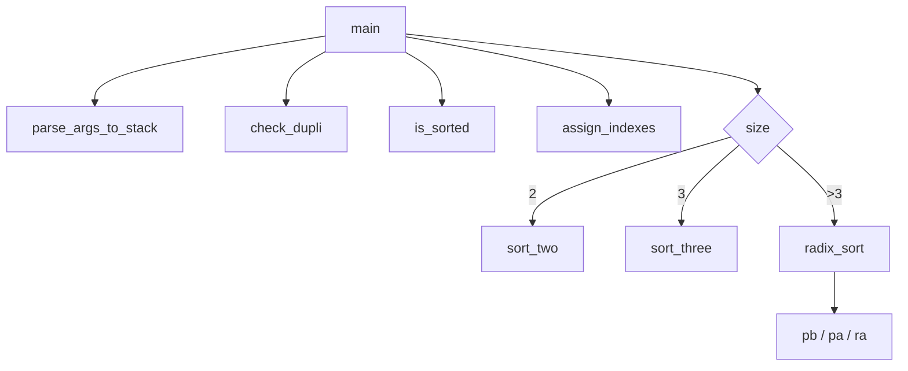

# Push_SWAPKO — pełne omówienie projektu

Ten dokument opisuje **cały aktualny projekt**: strukturę, przepływ działania i **każdą funkcję**.

---

## 1) Co robi program

`push_swap` przyjmuje liczby jako argumenty, buduje z nich stos `A`, a następnie wypisuje na `stdout` sekwencję operacji (`sa`, `pb`, `ra`, ...), która sortuje dane rosnąco.

W tej wersji:
- dla 2 elementów używane jest `sort_two`,
- dla 3 elementów używane jest `sort_three`,
- dla większych wejść używany jest `radix_sort` oparty o pola `index`.

---

## 2) Struktura danych

```c
typedef struct s_list
{
    int             value;
    int             index;
    struct s_list   *next;
    struct s_list   *prev;
} t_list;
```

- `value` — oryginalna liczba z wejścia.
- `index` — pozycja liczby w posortowanym zbiorze (0..n-1), potrzebna do radix.
- `next` / `prev` — dwukierunkowa lista reprezentująca stos.

---

## 3) Przepływ programu (`main.c`)

1. Inicjalizacja `a = NULL`, `b = NULL`.
2. Gdy `argc < 2` → zakończenie bez wypisywania.
3. Parsowanie argumentów do stosu `A` (`parse_args_to_stack`).
4. Sprawdzenie duplikatów (`check_dupli`).
5. Jeśli już posortowane (`is_sorted`) → wyjście bez operacji.
6. Nadanie indeksów (`assign_indexes`).
7. Wybór algorytmu:
   - 2 liczby → `sort_two`,
   - 3 liczby → `sort_three`,
   - więcej → `radix_sort`.
8. Zwolnienie pamięci (`free_stack`).

Funkcja pomocnicza:
- `print_error_and_free` — wypisuje `Error\n` na `stderr`, sprząta pamięć i zwraca kod błędu.

---

## 4) Operacje stosu

## `push_swap_rotation1.c`

### `sa(t_list *a, int print)`
Zamienia miejscami pierwsze dwa elementy stosu `A` (przez zamianę `value`).

### `sb(t_list *b, int print)`
Analogicznie dla stosu `B`.

### `ss(t_list *a, t_list *b)`
Wykonuje `sa` i `sb` bez osobnego printa, potem wypisuje `ss`.

### `pa(t_list **b, t_list **a)`
Przenosi element ze szczytu `B` na szczyt `A`.

### `pb(t_list **b, t_list **a)`
Przenosi element ze szczytu `A` na szczyt `B`.

> Uwaga: sygnatura jest w stylu `(**b, **a)`, bo pierwszy argument to stos docelowy/źródłowy zgodnie z implementacją.

## `push_swap_rotation2.c`

### `ra(t_list **a, int print)`
Rotate `A`: pierwszy element idzie na koniec.

### `rb(t_list **b, int print)`
Rotate `B`.

### `rr(t_list **a, t_list **b)`
`ra` + `rb`, potem wypisuje `rr`.

### `rra(t_list **a, int print)`
Reverse rotate `A`: ostatni element idzie na początek.

### `rrb(t_list **b, int print)`
Reverse rotate `B`.

## `push_swap_rrr.c`

### `rrr(t_list **a, t_list **b)`
`rra` + `rrb`, potem wypisuje `rrr`.

---

## 5) Lista i helpery bazowe

## `ps_list.c`

### `ps_lstnew(int value)`
Tworzy nowy węzeł listy (`value`, `index = 0`).

### `ps_lstlast(t_list *lst)`
Zwraca ostatni element listy.

### `ft_lstlast(t_list *lst)`
Wrapper kompatybilności (zwraca `ps_lstlast`).

### `ps_lstadd_back(t_list **lst, t_list *node)`
Dodaje węzeł na koniec listy.

### `ps_lstsize(t_list *lst)`
Zlicza elementy listy.

### `is_sorted(t_list *a)`
Sprawdza, czy `A` jest rosnące (`value`).

---

## 6) Parsowanie i walidacja danych

## `push_swap_atoi.c`

### `ft_atoi_safe(const char *str, int *error)`
Bezpieczne `atoi`:
- obsługa białych znaków,
- obsługa `+/-`,
- wykrywanie niedozwolonych znaków,
- zakres `int` (`INT_MIN..INT_MAX`).

W razie błędu ustawia `*error = 1`.

## `push_swap_parse.c`

### `is_space(char c)` *(static)*
Sprawdza, czy znak jest spacją/tabulatorem/znakiem białym ASCII.

### `append_value(t_list **a, const char *str)` *(static)*
Parsuje jeden token przez `ft_atoi_safe`, tworzy node i dopina do `A`.

### `parse_single_arg(const char *arg, t_list **a)` *(static)*
Obsługuje format: `./push_swap "3 2 1"`.
- dzieli string po whitespace,
- każdy token przekazuje do `append_value`,
- odrzuca pusty input (`""`, same spacje).

### `parse_args_to_stack(int argc, char **argv, t_list **a)`
Główne wejście parsera:
- `argc == 2` → tryb jednego stringa,
- inaczej każdy argument osobno.

## `push_swap_utils.c`

### `check_dupli(t_list *a)`
Sprawdza duplikaty metodą porównania par (`O(n^2)`).

### `free_stack(t_list **stack)`
Zwalnia wszystkie węzły listy i zeruje wskaźnik.

---

## 7) Sortowanie (w tym radix)

## `push_swap_sorting.c`

### `assign_indexes(t_list *a)`
Nadaje każdemu elementowi `index` równy liczbie elementów mniejszych od niego.

Dla unikalnych wartości daje to zakres `0..n-1`.

### `get_max_index(t_list *a)`
Zwraca największy `index` w liście.

### `sort_two(t_list **a)`
Dla 2 elementów: jeśli trzeba, wykonuje `sa`.

### `sort_three(t_list **a)`
Dla 3 elementów: zestaw warunków wybierający minimalną sekwencję operacji.

### `radix_sort(t_list **a, t_list **b)`
LSD radix po bitach `index`:
1. oblicza `max_bits`,
2. dla każdego bitu:
   - bit = 1 → `ra`,
   - bit = 0 → `pb`,
3. po każdej rundzie przerzuca wszystko z `B` do `A` (`pa`).

Dzięki indeksowaniu działa poprawnie również dla liczb ujemnych (`value`), bo sortuje po `index`.

---

## 8) Własne `ft_printf` (folder `printf/`)

## `ft_printf.c`

### `checking(const char *str, va_list argh)`
Dispatcher formatów: `c s d i % u p x X`.

### `ft_printf(const char *str, ...)`
Główna funkcja printf (iteruje po formacie i zlicza wypisane znaki).

## `pf_write.c`

### `ft_putchar_fd(char c, int fd)`
Wypisuje pojedynczy znak.

### `ft_putstr_fd(const char *s, int fd)`
Wypisuje string (dla `NULL` drukuje `(null)`).

### `ft_putendl_fd(const char *s, int fd)`
Wypisuje string + `\n`.

### `ft_putnbr_fd(int nb, int fd)`
Wypisuje liczbę signed int.

### `ft_putunbr_fd(unsigned int nb, int fd)`
Wypisuje liczbę unsigned int.

## `hexasmall.c`

### `odwroc_napis(char *str)` *(static)*
Odwraca napis i wypisuje go.

### `na_szesnastkowy(unsigned long liczba)`
Wypisuje liczbę w hex (`abcdef`).

## `hexabig.c`

### `odwroc_napis(char *str)` *(static)*
Jak wyżej, ale używane w wersji uppercase.

### `na_szesnastkowy_d(unsigned long liczba)`
Wypisuje liczbę w hex (`ABCDEF`).

## `printingpointer.c`

### `printpointer(va_list arg)`
Wypisuje wskaźnik:
- `NULL` → `(nil)`,
- inaczej `0x` + hex adresu.

## `ft_strlen.c`

### `ft_strlen(const char *str)`
Zwraca długość stringa.

---

## 9) Jak uruchamiać

```bash
make
./push_swap 3 2 1
./push_swap "3 2 1"
```

Przykłady zachowania:
- dane już posortowane → brak output,
- błędne dane / duplikaty → `Error`.

---

## 10) Mini mapa zależności



---

## 11) Najważniejsze do zapamiętania (na obronę)

- Sortujesz **po indeksach**, nie bezpośrednio po wartościach.
- `radix_sort` działa bit po bicie od najmłodszego bitu.
- Stos `B` jest buforem dla elementów z bitem `0`.
- Dla małych wejść (`2`, `3`) używasz dedykowanych, krótkich strategii.

Powodzenia — masz już bardzo sensowną bazę projektu 🚀
